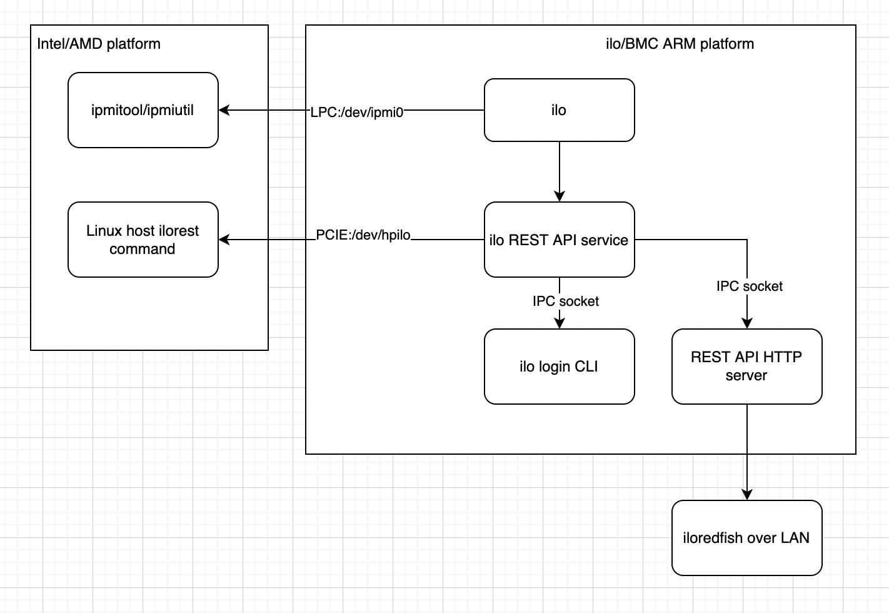
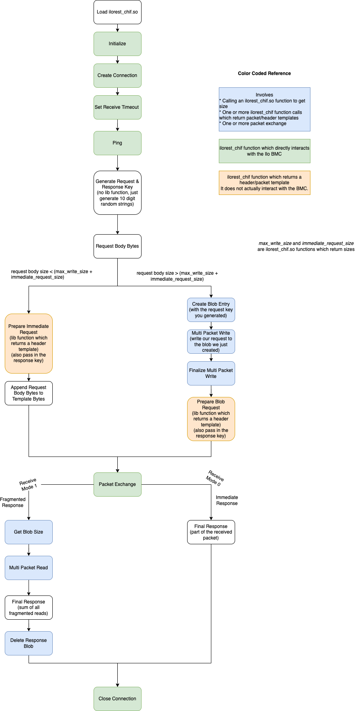

# blobstore study based on opensource ilorest tool

Redfish can be consumed over:

- Standard networking protocols like TCP/HTTP but this requires authentication credentials and network access to the BMC.
- By accessing `/dev/hpilo` directly. This doesn’t require authentication credentials. HPE doesn’t provide any documentation for this approach but they provide an python based ilorest CLI tool which calls a closed-source dynamically loaded shared object library called `ilorest_chif.so` which does the magic. The transport method used here instead of TCP is called Blobstore2.

**A possible iLO architecture but may be wrong. TO BE CONFIRMED/CORRECTED.**

## Overview

We figured out most of `ilorest_chif.so`'s function signatures and transport mechanism by looking at HPE’s python ilorest CLI tool which calls it.

`ilorest_chif.so` has many functions but around 30 are needed to make an HTTP request. After experimentation I've defined their function signatures in chif.rs.

They're of three types:

- Functions which directly interact with the iLO BMC (create, close, initialize, set timeout, ping and packet exchange). As far as I know there are only six of them.
- Functions which return a size (`get_read_request_size`, `max_buffer_size`, etc)
- Functions which return a header/packet template. They generally have an associated function which returns the size of this template. You may or may not modify this template and then you have to call packet exchange with this header/packet template as input.

A common pattern seen in `ilorest_chif.so` is that you pass some arguments to a function (ex: `read_fragment`) and that function will return a pointer to an array of bytes. Then you have to call another associated function (in this case `get_read_request_size`) which will return the size of the array pointed by the pointer. Lets call this array the packet. You can modify the packet if required. In some cases you might need to append more data to the packet.

Note that none of this actually communicated with the iLO BMC. To do that you have to do a packet exchange where you send this packet to the BMC and then read its response.

## Packet Exchange process

**Input:** Input Packet Bytes

**Output:** Response Packet Bytes

- Get receive buffer size by calling: `max_buffer_size`.
- Create a receive buffer of this size.
- Call `packet_exchange` and provide pointers to input packet and receive buffer
- Packet exchange status code should be zero.
- In the response packet, error code (`u32` after the initial 8 bytes) should be zero.
- Sequence number from response packet bytes should match sequence number from input packet bytes (in both request and response packets its the `u16` after the initial 2 bytes).

## Blobstore

- Blobstore is a key value store.
- For large requests and large responses `ilorest_chif.so` uses blobstore instead of directly passing in data.
- Keys can be alphanumeric.
- For requests both uefisettings and ilorest use the `volatile` namespace.
- This namespace is automatically cleared after ~ 1 hour. This is based on experimentation but not confirmed.
- You can use uefisettingslib's ilorest bindings to add/view stuff in blobstore.
- Ways to list entries in the `volatile` namespace fail on the machines I've tested. You can still view values if you know their key. This is not a problem for other namespaces.

## Request over Blobstore process

To make an HTTP request over blobstore, convert your HTTP request into utf-8 bytes.

The following steps are highlighted in the diagram below.

